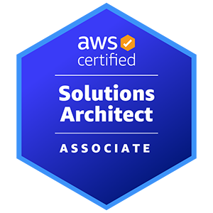

<link rel="stylesheet" type='text/css' href="https://cdn.jsdelivr.net/gh/devicons/devicon@latest/devicon.min.css" />

<p align="center">
  <a href="https://git.io/typing-svg">
    
  </a>
</p>

## 👨‍💻 About Me

I'm a **DevOps Engineer** at [Codebit](https://www.codebit.com.br/), an **AWS Partner Network (APN)** company, where I help clients design and implement scalable, secure, and resilient cloud architectures.

I have hands-on experience with automation, monitoring, Infrastructure as Code (IaC), and AWS service integration. I've also developed projects using Node.js, Python, and Java. My passion lies in solving complex problems, optimizing environments, and sharing knowledge about cloud computing and engineering best practices.

Run this on your terminal and get a surprise:
```bash
curl https://welcome.carrijo.dev.br/ | jq
```


## 🎓 Certifications

I currently hold **6 AWS certifications**:

<p align="center">
  <a href="https://www.credly.com/badges/4bcd8936-4c93-4954-9192-cc34b85da395/public_url">
    
  </a>
  <a href="https://www.credly.com/badges/88b2ae60-14b5-4411-a5e3-db261e731ad3/public_url">
    
  </a>
  <a href="https://www.credly.com/badges/2ae19d20-dc63-459a-8a65-0fe72fa6c01a/public_url">
    
  </a>
  <a href="https://www.credly.com/badges/7a8919fa-96f3-45eb-87a4-11cc53032399/public_url">
    
  </a>
  <a href="https://www.credly.com/badges/36d7df65-42ff-4622-a1d5-e98e036e50c5/public_url">
    
  </a>
  <a href="https://www.credly.com/badges/36d7df65-42ff-4622-a1d5-e98e036e50c5/public_url">
    
  </a>
</p>

| Certification | Description |
|:-------------:|-------------|
| **[Devops Engineer – Professional](https://www.credly.com/badges/4bcd8936-4c93-4954-9192-cc34b85da395/public_url)** | CI/CD Pipelines configuration, deployment strategies at scale, infrastructure automations |
| **[Solutions Architect – Professional](https://www.credly.com/badges/88b2ae60-14b5-4411-a5e3-db261e731ad3/public_url)** | Complex architectures, large-scale migration, cost optimization, security, and hybrid/multi-account workloads |
| **[Security – Specialty](https://www.credly.com/badges/2ae19d20-dc63-459a-8a65-0fe72fa6c01a/public_url)** | Defense in depth: KMS, advanced IAM, WAF/Shield, incident response, data protection |
| **[Solutions Architect – Associate](https://www.credly.com/badges/7a8919fa-96f3-45eb-87a4-11cc53032399/public_url)** | Highly available and resilient architectures, networking, storage, and service integration |
| **[SysOps Administrator – Associate](https://www.credly.com/badges/36d7df65-42ff-4622-a1d5-e98e036e50c5/public_url)** | Operations and monitoring: CloudWatch, automation, high availability, backup/DR |
| **[Cloud Practitioner](https://www.credly.com/badges/36d7df65-42ff-4622-a1d5-e98e036e50c5/public_url)** | Cloud fundamentals, cost models, shared responsibility, and core services |

## 🛠️ Tech Stack

<details open>
<summary><b>☁️ DevOps & Cloud</b></summary>
<br>
<p align="center">
  
</p>
</details>

<details open>
<summary><b>💾 Databases</b></summary>
<br>
<p align="center">
  
</p>
</details>

<details open>
<summary><b>⚙️ Backend</b></summary>
<br>
<p align="center">
  
</p>
</details>

<details open>
<summary><b>🎨 Frontend</b></summary>
<br>
<p align="center">
  
</p>
</details>


## 📊 GitHub Stats

<div align="center">
  <a href="https://github.com/Pranesh-2005/github-readme-stats-fast">
    
  </a>

  <a href="https://github.com/Pranesh-2005/github-readme-stats-fast">
    
  </a>

</div>


## 📫 Let's Connect

<p align="center">
  <a href="https://www.linkedin.com/in/jo%C3%A3o-victor-carrijo-pereira-651074266/">
    
  </a>
  &nbsp;
  <a href="mailto:joao@carrijo.dev.br">
    
  </a>
</p>

<p align="center">
  <i>⭐ Feel free to star my repositories if you find them useful!</i>
</p>
